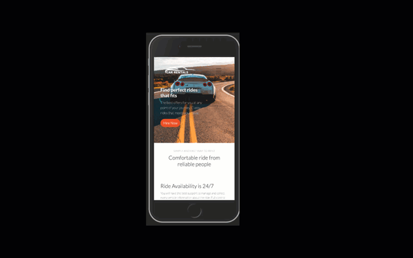

# STOCKIST WEB APP - REACT CAPSTONE PROJECT

In this project, I developed a frontend web application, Car Rentals using [Car Rentals API](https://financialmodelingprep.com/developer/docs/) I also develop, a requirement for my final capstone project to consume the data using React Application.

The application features includes:
- A proper Authentication for Sign in and Sign up
- A secure page that requires authentication using JWT 
- Listing of Cars for Hire
- User can add car to favourites
- User can access list of cars added as favourites



## Live Demo
[Live Demo](https://hire-a-car-client.herokuapp.com/)

## Video Presentation
[YouTube Link](#)

## Getting Started

To get a local copy up and running follow these simple example steps.

### Prerequisites

Make sure Node.js is running on your local machine

### Setup

~~~bash
$ git clone https://github.com/acushlakoncept/car-rentals-client.git
$ cd rcar-rentals-client
~~~

Install modules:

```
yarn add
```

### Usage

Start server with:

```
    yarn start or npm start
```
### Running Test
Jest is used to run all the tests found in this application
In order to run the test you can simply type `yarn test` or `npm run test`

Either ways, if you encounter any error while running either command, its likely you do not have `jest` installed globally, so please run `npm install -g jest-cli` then try again. That should do it.

### Deployment instructions

```
    git add .
    git commit -m "ready for first push to heroku"  
    heroku create $APP-NAME --buildpack mars/create-react-app
    git push heroku $BRANCH_NAME:master
```

Fire up your app by running `heroku open` Yay!!! your app has been deployed successfully.

# Authors

👤 **Uduak Essien**

- Github: [@acushlakoncept](https://github.com/acushlakoncept/)
- Twitter: [@acushlakoncept](https://twitter.com/acushlakoncept)
- Linkedin: [acushlakoncept](https://www.linkedin.com/in/acushlakoncept/)

## 🤝 Contributing

Contributions, issues and feature requests are welcome!

Feel free to check the [issues page](issues/).

## Show your support

Give a ⭐️ if you like this project!

## Acknowledgments
- [Microverse Inc](https://www.microverse.org/)
- [Design Inspiration](https://www.behance.net/gallery/37706679/Circle-(Landing-page-Dashboard-Mobile-App)), Design Idea by [Alexey Savitskiy on Behance](https://www.behance.net/alexey_savitskiy)